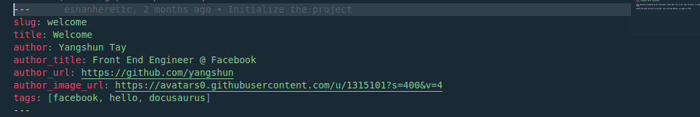

# Website

This website is built using [Docusaurus 2](https://docusaurus.io/),a modern static website generator,
as part of [GSoC '21](https://summerofcode.withgoogle.com/).

## Table of contents

<details open="open">
  <summary>Table of Contents</summary>
  <ol>
    <li>
      <a href="#getting-started">Getting Started</a>
      <ul>
        <li><a href="#prerequisites">Prerequisites</a></li>
        <li><a href="#installation">Installation</a></li>
        <li><a href="#local-development">Local Development</a></li>
        <li><a href="#build">Build</a></li>
      </ul>
    </li>
    <li>
      <a href="#adding-content">Adding Content</a>
      <ul>
        <li><a href="#feature-cards">Feature Cards</a></li>
        <li><a href="#pecan-people">PEcAn People</a></li>
        <li><a href="#blog">Blog</a></li>
      </ul>
    </li>
    <li><a href="#screenshots">Screenshots</a></li>
    <li><a href="#contributing">Contributing</a></li>
    <li>
      <a href="#adding-content">Next Steps</a>
      <ul>
        <li><a href="#optimising-documentation">Optimising documentation</a></li>
        <li><a href="#adding-tutorials">Adding tutorials section</a></li>
        <li><a href="#blog">Blog</a></li>
      </ul>
    </li>
  </ol>
</details>

## Getting Started

This section will help one to setup the project for local development.

### Prerequisites

This project has been built using [Docusaurus 2](https://docusaurus.io/), so make sure that your machine has Node version >=12.13.0, you can check this using `node -v`. [Install node](https://nodejs.org/en/download/).
Make sure yarn is installed. [Install yarn](https://classic.yarnpkg.com/en/docs/install/#debian-stable)

### Installation

```console
yarn install
```

### Local Development

```console
yarn start
```

This command starts a local development server and opens up a browser window. Most changes are reflected live without having to restart the server.

### Build

```console
yarn build
```

This command generates static content into the `build` directory and can be served using any static contents hosting service.

## Adding Content

This section will help to add or modify Website's content.

### Feature Cards

Feature Cards are cards present at the website homepage whose main purpose is to highlight the key features of the PEcAn Project.


To modify its contents-

- Navigate to `src/components/HomepageFeatures.js`
- Navigate to `const FeatureList` inside `HomepageFeatures.js`


Every item inside `FeatureList` array contains a JavaScript object enclosed `{}` and separated by `,` . Each of these objects is a feature that is displayed on the homepage and contains a `title`, `Svg` and `description`. One can edit or remove them as required, the changes will be reflected after the code passes build test. If one is editing `Svg` make sure that the required image file is present inside `static/img` directory, otherwise the compiler would return an error.

### PEcAn People

The people page contains details of the PEcAn team. The image here is a representation of how the page should look like with placeholder values.


To add and modify information move to the `static/utils/contributors.js` file. It contains an array called `contributors` which contains JavaScript objects which are enclosed by `{}` and contain following fields-


In order to add a contributor, copy any object enclosed by `{}` and paste after the last object. Make sure two objects are separated by a `,`. Now one can easily edit information in the pasted object.
One could add information accordingly in the different fields. The information would be automatically updated after successful push.

### Blog

The blog can be found at the top, in the navigation menu. It comes by default in docusaurus and more information about it can be found on (https://docusaurus.io/docs/blog). By default when someone clicks on `docs` link they will be directed to a page containing list of all present blogs on the website.

To add a blog, navigate to `blog` directory in the repository and create a '.md' file. To know more about markdown visit (https://guides.github.com/features/mastering-markdown/). Make sure to name the file in `yyyy-mm-dd-title.md` format, this makes it easier for parser to render blogs. In the top of your blog file add a yaml header similar to the picture below.



The `title`, `author` and `tags` are important for giving the blog a meaning and making it more user friendly. To know more about these yaml headers visit (https://docusaurus.io/docs/blog#header-options). After adding the yaml headers you can start writing your blog and save the file. After successful push the blog would be added to the website.

## Screenshots

This section contains screenshots of website's homepage in light and dark theme.

[LightTheme](screenshots/light.png)

[DarkTheme](screenshots/dark.png)

## Contributing 

Everyone is welcome to contribute to this project. The rules are simple:
- Be polite, be patient.
- Be specific about your doubts, make sure you read this documentation carefully. 

## Next Steps

This section contains future plans for the website. New contributors can use this section as a reference for planning their contributions. 