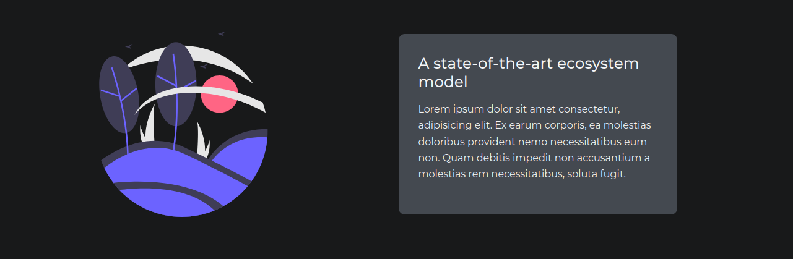
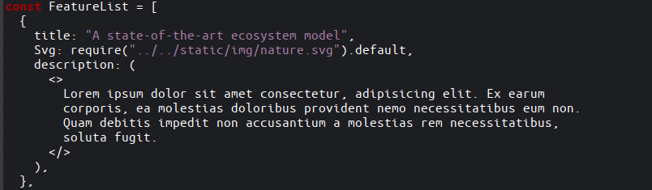
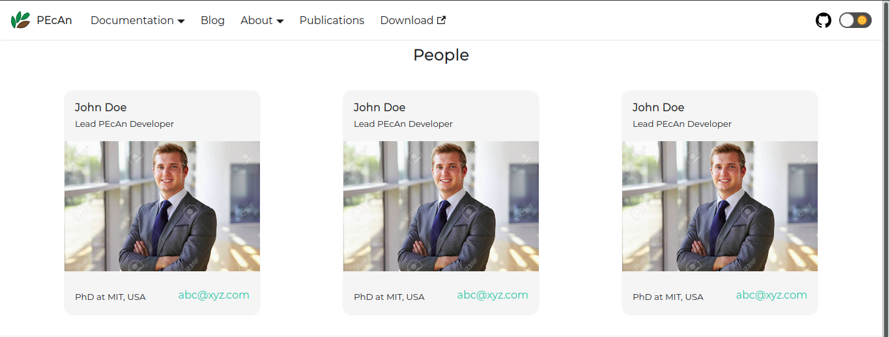
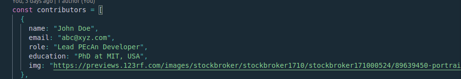
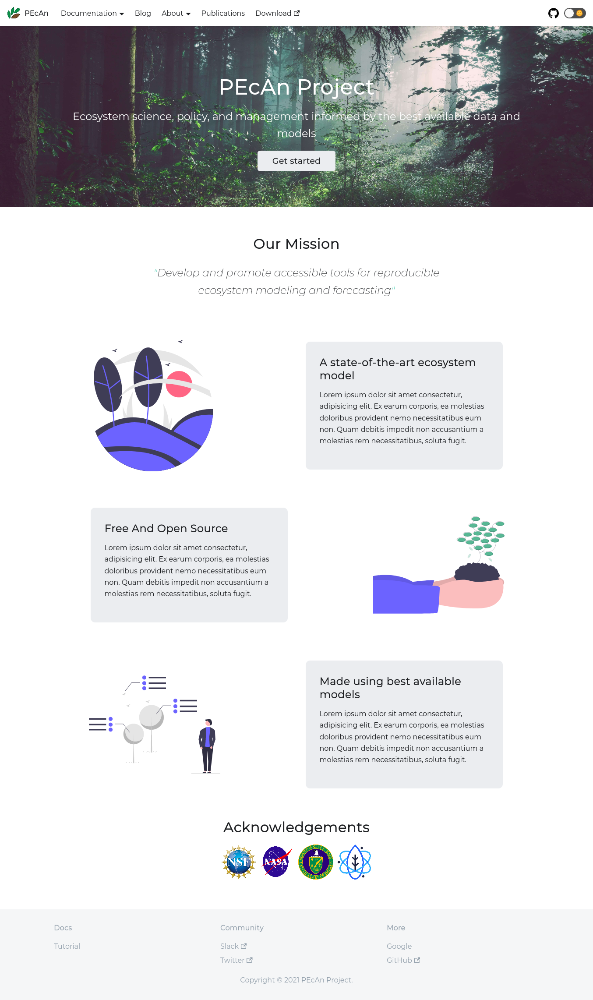
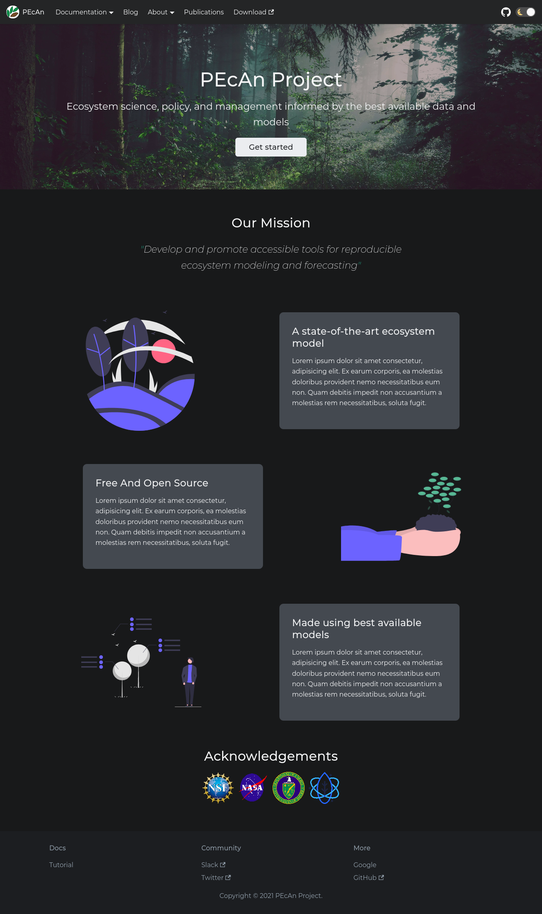

# PEcAn Project Website

This repository contains the content of the PEcAn Project website.

This README is written for members of the PEcAn Project community who wish to add content to or otherwise modify the website.
The website is built using [Docusaurus 2](https://docusaurus.io/), a modern static website generator.
The [Docusaurus Documentation](https://docusaurus.io/docs) provides details on maintaining the website; this README is not intended to replace the Docusaurus documentation.
Rather, it is intended to provide a brief introduction to common tasks as well as project specific information.

This site was created by Eshan Tripathi with mentorship from Prakher Prashank as part of [GSoC '21](https://summerofcode.withgoogle.com/).

## Table of contents

<details open="open">
  <summary>Table of Contents</summary>
  <ol>
    <li>
      <a href="#getting-started">Getting Started</a>
      <ul>
        <li><a href="#prerequisites">Prerequisites</a></li>
        <li><a href="#installation">Installation</a></li>
        <li><a href="#local-development">Local Development</a></li>
        <li><a href="#build">Build</a></li>
      </ul>
    </li>
    <li>
      <a href="#adding-content">Adding Content</a>
      <ul>
        <li><a href="#feature-cards">Feature Cards</a></li>
        <li><a href="#pecan-people">PEcAn People</a></li>
        <li><a href="#blog">Blog</a></li>
      </ul>
    </li>
    <li><a href="#screenshots">Screenshots</a></li>
    <li><a href="#contributing">Contributing</a></li>
    <li>
      <a href="#next-steps">Next Steps</a>
      <ul>
        <li><a href="#optimising-documentation">Optimising documentation</a></li>
        <li><a href="#adding-tutorials">Adding tutorials section</a></li>
        <li><a href="#blog">Blog</a></li>
      </ul>
    </li>
  </ol>
</details>

## Getting Started - Setting up the project for local development

This section will help one to setup the project for local development.

### Requirements

- Node version >= 12.13.0
- yarn

This project has been built using [Docusaurus 2](https://docusaurus.io/), which requires Node version >=12.13.0, you can check this using `node -v`. [Install node](https://nodejs.org/en/download/).
Make sure yarn is installed. [Install yarn](https://classic.yarnpkg.com/en/docs/install/#debian-stable).

### Installation

```console
yarn install
```

### Local Development

```console
yarn start
```

This command starts a local development server and opens up a browser window. Most changes are reflected live without having to restart the server.

### Build

```console
yarn build
```

This command generates static content into the `build` directory and can be served using any static contents hosting service.

## Adding Content

This describes how to add or modify the Website's content.

### Add or Edit Feature Cards

Feature Cards on the website homepage highlight the key features of the PEcAn Project.



To modify the feature cards-

- Navigate to `src/components/HomepageFeatures.js`
- Navigate to `const FeatureList` inside `HomepageFeatures.js`



Every item inside the `FeatureList` array contains a JavaScript object enclosed `{}` and separated by `,` .
Each of these objects is a feature that is displayed on the homepage and contains a `title`, `Svg` and `description`.
You can edit or remove feature cards and the changes will be reflected after the code passes build test.
If you are adding or editing an image file, the image file must is present inside `static/img` directory, otherwise the compiler would return an error.
You should use SVG images when available.

### Add or Edit a Person (Contributors)

The people page contains details of the PEcAn team. The image here is a representation of how the page should look like with placeholder values.



```javascript
const contributors = [
  {
    name: "John Doe",
    email: "abc@xyz.com",
    role: "Lead PEcAn Developer",
    education: "PhD at MIT, USA",
    img: "https://previews.123rf.com/images/stockbroker/stockbroker1710/stockbroker171000524/89639450-portrait-of-a-young-smiling-professional-man-arms-crossed.jpg",
  },
];
```

To add and modify information move to the `static/utils/contributors.js` file.
It contains an array called `contributors` which contains JavaScript objects which are enclosed by `{}` and contain following fields-



To add a contributor:

1. Copy an existing user's information and paste as a new object in the appropriate order.
2. Make sure two objects are separated by a `,`.
3. Edit information in the pasted object.
4. Add an image to `static/img/people`
5. Add link to image
6. Build site and check that the new contributor record appears where expected

The new contributor and / or any changes will appear on the website automatically after changes are successfully merged into the main branch.

### Add or Edit a Blog Post

A link to blog posts can be found in the navigation menue at the top of the website.
The Docusaurus blog feature is described in detail in the [Docusaurus documentation](https://docusaurus.io/docs/blog).
By default when someone clicks on `blog` link they will be directed to a page containing list of all present blogs on the website.

Steps to add a blog post:

1. Create a new file named `blog/yyyy-mm-dd-title.md`
2. In the top of your blog file add a yaml header.
3. Add at least `title`, `author` and `tags` yaml fields.
   - These metadata fields help with search and navigation on the site.
   - These and other yaml header options are described in the [blog header options](https://docusaurus.io/docs/blog#header-options) section of the Docusaurus documentation.
4. writing your blog and save the file.
5. any images can be put in `static/img/` and referenced using a relative path `static/img/myimage.png`
6. build the website to make sure the blog shows up as expected
7. After the new changes are merged into the main branch, the new blog post will appear on the website.

```yml
title: GSoC '21 Report- Webpage Updates
author: Eshan Tripathi
author_title: GSoC'21 participant @PEcAn Project
author_url: https://github.com/eshantri
author_image_url: https://avatars.githubusercontent.com/u/48446729?v=4
tags: [gsoc, gsoc21]
```

## Screenshots

This section contains screenshots of website's homepage in light and dark theme.





## Contributing

This is an open source project and contributions are what make an open source community.
Everyone is welcome to contribute to this project.
All involved are expected to follow the [PEcAn code of conduct](https://pecanproject.github.io/pecan-documentation/master/contributor-covenant-code-of-conduct.html) and contribute to a positive and inclusive environment.

First time contributors are welcome. Contributions can be very simple, make sure to check out beginner friendly issues, if present.

## Next Steps

This section contains future plans for the website. New contributors can use this section as a reference for planning their contributions.

### Optimising Documentation

At present the PEcAn's documentation is being served from (<https://pecanproject.github.io/pecan-documentation/master/>) using an iframe. While this saves a lot of overhead in converting Rmd files in (<https://github.com/PecanProject/pecan/tree/develop/book_source>) to md files so that docusaurus could render them, it also increases the loading time for documentation, it also looks less consistent.
In future, it is suggested to find an optimised way to convert rmd files to md and integrate them via docusaurus's native documentation parser.

### Adding tutorials section

The tutorials section from old site need to be migrated into the new site.
One can find tutorials here (<https://github.com/PecanProject/pecan/tree/develop/documentation/tutorials>).
